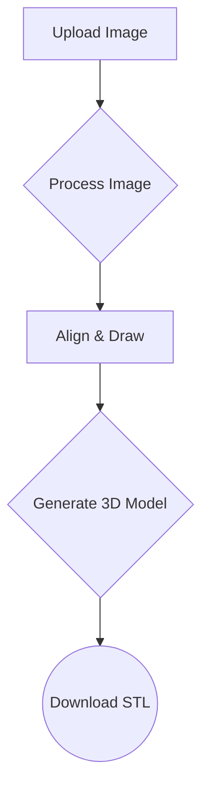
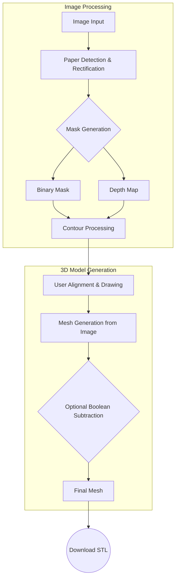

# Gridfinity Shadowboard Maker - to gridfinity and beyond!

Your drawer needs a makeover? Then you might need custom inserts for your tools, but this is a lot of work.
This app is made to speed up the process (about 2min per insert). Make a picture of your tool**s** on a paper (on non white background), upload and get your stl.
It is system agnostic, because you can upload your baseplate and it will create the matching cutout (tolerances included)

The main advantages of this solution are its **ease of use** and **speed**.

## How to Use

The easiest way to use the Shadowboard Maker is to visit the web application: use two tabs in parallel to skip the loading times :)

[**shadowboardmaker.streamlit.app**](https://shadowboardmaker.streamlit.app)

## How to Run Locally (faster processing)

To run the application on your own machine, follow these steps:

1.  **Clone the repository:**
    ```bash
    git clone https://github.com/nicolai-wachenschwan/Gridfinity_Shadowboard_Maker.git
    cd Gridfinity_Shadowboard_Maker
    ```

2.  **Install dependencies:**
    It is recommended to use a virtual environment.
    ```bash
    python -m venv venv
    source venv/bin/activate  # On Windows, use `venv\Scripts\activate`
    pip install -r requirements.txt
    ```

3.  **Run the Streamlit app:**
    ```bash
    streamlit run app.py
    ```

## Contributions

Contributions are welcome! If you have ideas for improvements or want to fix a bug, feel free to open an issue or create a pull request.

## Known Bugs

*   **Mobile Experience**: The application does not work on mobile devices due to reloading issues.

## User Path



## Processing Pipeline


